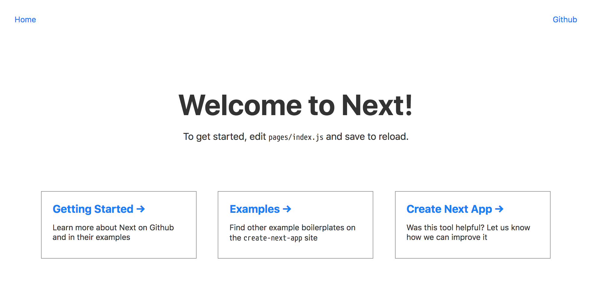
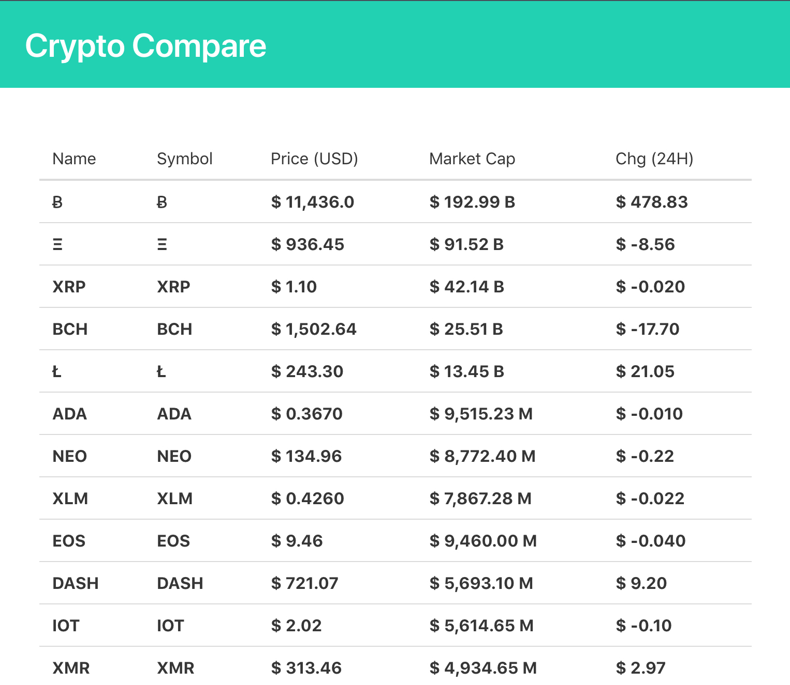
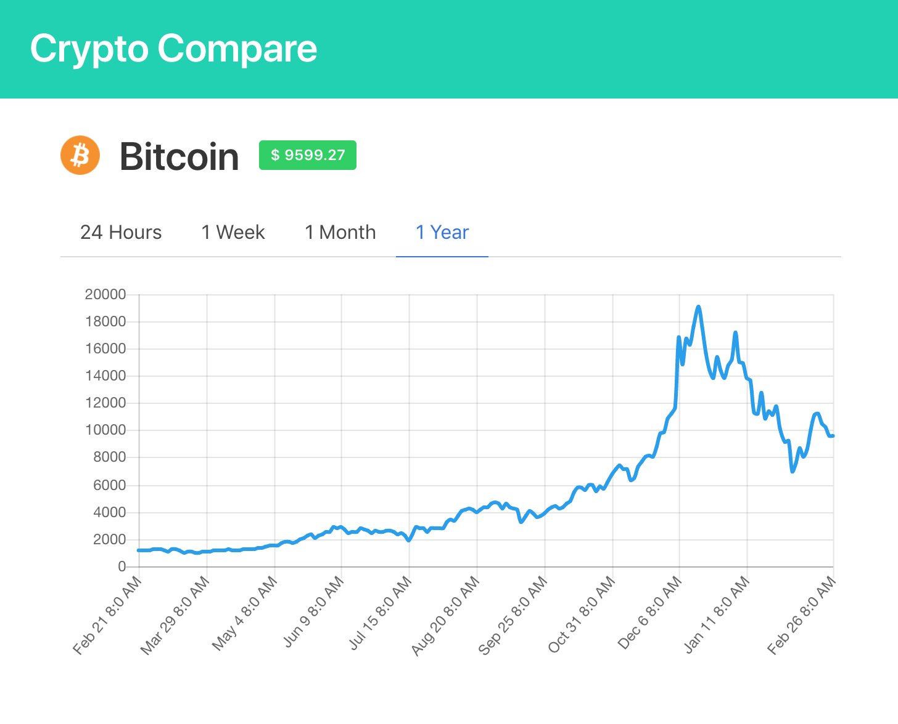

# An app for displaying cryptocurrency live pricing data

# next.js

> next.js 是一个基于 React 的通用 JavaScript 框架，next.js 为 React 组件模型提供了扩展，支持基于服务器的组件渲染 (SSR)，同时也支持在客户端继续进行渲染。
>
> 本文通过实现一个热门加密货币行情的网站来学习 next.js。

## 准备

官网 https://github.com/zeit/next.js

入门教程 https://learnnextjs.com/

本文代码运行环境:

* macOS High Sierra 10.13.3
* Node.js 8.9.4

完整代码 https://github.com/lxzxl/crypto-compare

## 开始

使用 [create-next-app](https://github.com/segmentio/create-next-app) 命令创建项目。

```shell
npm i -g create-next-app
create-next-app crypto-compare
cd crypto-compare
npm run dev
```



项目结构：

```
crypto-compare/
  README.md
  package.json
  next.config.js
  components/
    index.js
    head.js
    nav.js
  pages/
    index.js
  static/
    favicon.ico
```

### 启用 sass 支持

使用插件 [next-sass](https://github.com/zeit/next-plugins/tree/master/packages/next-sass)

```shell
npm i @zeit/next-sass node-sass
```

使用方法：

样式文件最终会被编译到 `.next/static/style.css`。必须使用一个自定义的 `_document.js` 来引导这个样式文件。

```javascript
// ./pages/_document.js
import Document, { Head, Main, NextScript } from 'next/document';

export default class MyDocument extends Document {
  render() {
    return (
      <html>
        <Head>
          <link rel="stylesheet" href="/_next/static/style.css" />
        </Head>
        <body>
          <Main />
          <NextScript />
        </body>
      </html>
    );
  }
}
```

然后修改 `next.config.js` 让 next 或者说 webpack 支持 scss 文件：

```javascript
// next.config.js
const withSass = require('@zeit/next-sass');
module.exports = withSass({
  webpack: config => {
    // Fixes npm packages that depend on `fs` module
    config.node = {
      fs: 'empty'
    };

    return config;
  }
});
```

现在在我们的页面代码中直接引入需要的 scss 文件即可：

```Javascript
// components/layout.js
import '../static/styles.scss';
```

本项目中我使用 bulma.css 最为基础 css 框架，所以需要在 styles.scss 中引入 bulma.css。

```scss
// static/styles.scss
@import '~bulma/css/bulma.css';
```

### 同构 API 请求库

使用 [axios](https://github.com/axios/axios), 原因是 server 端和 client 端都支持。

```shell
npm i axios
```

## 实现页面

基本工作已经完成，接下来就要专注于功能实现上了。功能基本复制于 https://cn.investing.com/crypto/currencies。数据则来自 [开源 API](https://www.cryptocompare.com/api/)。

明确我们需求：

* 首页 - 显示一个频繁更新的加密货币表格。
* 详细页面 - 用户选择某个货币，显示该货币的价格历史。

因为不止一个页面，我就先写了一个通用的基本布局组件 `components/layout.js`，其他页面的内容都是这个组件的 `props.children`。

```react
import '../static/styles.scss';
import Head from './head';
const Fragment = React.Fragment;
const Layout = props => (
  <Fragment>
    <Head {...props} />
    <section className="hero is-primary is-small">
      <div className="hero-body">
        <div className="container">
          <h1 className="title">Crypto Compare</h1>
        </div>
      </div>
    </section>
    <section className="section content">
      <div className="container">{props.children}</div>
      <style jsx>{`
        .content {
          padding: 3rem 5%;
        }
      `}</style>
    </section>
  </Fragment>
);
export default Layout;
```

### 货币列表

首页要显示一个各种货币的价格表。可以先来实现一个单独的货币列表的组件 `components/coinList.js`：

```react
const List = ({list}) => {
  return (
    <table className="table is-hoverable is-fullwidth">
      <thead>
        <tr>
          <td>Name</td>
          <td>Symbol</td>
          <td>Price (USD)</td>
          <td>Market Cap</td>
          <td>Chg (24H)</td>
        </tr>
      </thead>
      <tbody>
        {list.map(({USD}) => (
          <tr key={USD.FROMSYMBOL}>
            <th>{USD.FROMSYMBOL}</th>
            <th>{USD.FROMSYMBOL}</th>
            <th>{USD.PRICE}</th>
            <th>{USD.MKTCAP}</th>
            <th>{USD.CHANGE24HOUR}</th>
          </tr>
        ))}
      </tbody>
    </table>
  );
};
```

然后是首页页面：

```react
import axios from 'axios';
import {array} from 'prop-types';
import Layout from '../components/layout';
import CoinList from '../components/coinList';

const Index = ({coinList}) => (
  <Layout title="Home">
    <CoinList list={coinList} />
  </Layout>
);

Index.propTypes = {
  coinList: array
};

Index.getInitialProps = async ({req}) => {
  const {data} = await axios.get('https://min-api.cryptocompare.com/data/pricemultifull', {
    params: {
      fsyms: 'BTC,ETH,XRP,BCH,LTC,ADA,NEO,XLM,EOS,DASH,IOT,XMR,XEM,ETC,TRX,VEN,LSK,QTUM,BTG,USDT',
      tsyms: 'USD'
    }
  });
  const displayData = data.DISPLAY;
  return {
    coinList: Object.keys(displayData).map(k => displayData[k])
  };
};

export default Index;
```

最开始打算把 `getInitialProps` 方法放到 `coinList.js` 组件中，但文档说 getInitialProps 方法只会在 pages 目录下的文件中执行 (\*Note: getInitialProps can \*_not\*\* be used in children components. Only in pages._)

这样，一个粗糙的首页就完成了



但这只是一个很简单的页面，没有定时自动更新数据的功能，接下来我们加上自动更新功能。

因为有自动更新，所以这个页面就应该有自己的状态和生命周期，所以函数组件就不太合适了，需要使用有状态的组件。

```react
import axios from 'axios';
import {Component} from 'react';
import {array} from 'prop-types';
import Layout from '../components/layout';
import CoinList from '../components/coinList';

class Index extends Component {
  static async fetchData() {
    const {data} = await axios.get('https://min-api.cryptocompare.com/data/pricemultifull', {
      params: {
        fsyms: 'BTC,ETH,XRP,BCH,LTC,ADA,NEO,XLM,EOS,DASH,IOT,XMR,XEM,ETC,TRX,VEN,LSK,QTUM,BTG,USDT',
        tsyms: 'USD'
      }
    });
    const displayData = data.DISPLAY;
    return {
      coinList: Object.keys(displayData).map(k => displayData[k])
    };
  }

  static async getInitialProps({req}) {
    return this.fetchData();
  }
  constructor(props) {
    super(props);
    this.state = {coinList: props.coinList};
  }
  componentDidMount() {
    this.timerID = setInterval(async () => {
      const newData = await this.constructor.fetchData();
      this.setState(newData);
    }, 10000);
  }
  componentWillUnmount() {
    clearInterval(this.timerID);
  }
  render() {
    const {coinList} = this.state;
    return <Layout title="Home">{coinList && <CoinList list={coinList} />}</Layout>;
  }
}

Index.propTypes = {
  coinList: array
};

export default Index;
```

解释一下，我在 `componentDidMount` hook 中添加了一段每隔 10 秒拉取数据的代码。获得新数据后会 setState 更新组件。这样页面上的数据每隔 10 秒就会更新一次。查看网页源代码可以确认，确实是可以服务端渲染，没毛病。

### 货币历史

首先我们要给历史页面一个入口链接，把价格单元格改为链接，并把选中的货币当作参数传给历史页面：

```react
import Link from 'next/link';

...
<th>
  <Link href={{ pathname: '/history', query: { symbol} }}>
    <a>{price.PRICE}</a>
  </Link>
</th>
...
```

然后在 `pages` 目录下添加 `history.js` 文件作为历史页面。因为需要显示不同时间段的价格曲线，所以做一个有状态的组件比较好：

```
class History extends React.PureComponent {
  static async getInitialProps(ctx) {
  	const {symbol} = ctx.query;
  	return {history: await fetchCoinHistory(symbol)}
  }
  constructor(props) {
    super(props);
    this.state = {
      history: props.history
    };
  }
  render(){
    <Layout title="History">
    	<CoinHistory data={history} />
    </Layout>
  }
}
```

同样，我们在 `getInitialProps` 中拿到当前货币，然后调用 API 获取历史价格，传递给 `CoinHistory` 组件渲染出来。图标是用 chart.js 画的，无须多说。

最终的效果就是：



为了能返回首页，可以把 H1 改为到首页的链接：

```react
<h1 className="title">
  <Link href={'/'}><a>Crypto Compare</a></Link>
</h1>
```

## 其他

这样，一个基本的加密货币价格网站就可以使用的，如果有兴趣的话，可以加入一些其他功能，比如价格升降的不同样式，高亮有变化价格等等。。
